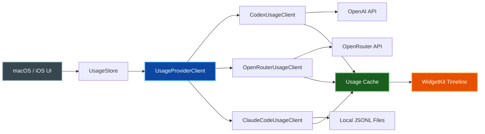

# Codex Monitor

[](LICENSE)

[](https://swift.org)

A native Apple app for monitoring AI coding-agent usage across **OpenAI Codex**, **OpenRouter**, and **Claude Code**. Shows usage windows with remaining quota percentages, progress bars, and reset countdown timers. Built with SwiftUI for macOS and iOS, with WidgetKit home-screen widgets.


## Quick Start

### Prerequisites

| Requirement | Notes |
|-------------|-------|
| **macOS 15+** | Required for the macOS app |
| **iOS/iPadOS 17+** | Required for the iOS app |
| **Xcode** | With iOS/macOS SDKs |
| **XcodeGen** | `brew install xcodegen` |
| **Apple dev team** | `QMLVG482FY` configured for signing |

### Build and Run

```bash
git clone https://github.com/paulrobello/codex-monitor.git
cd codex-monitor
make run
```

`make run` generates the Xcode project, builds the macOS app, installs it to `~/Applications/CodexMonitor.app`, and launches it.

### Install on iPhone

```bash
make launch-phone                  # Build, install, and launch on "Pauls iPhone 17"
make launch-phone PHONE_DEVICE="Your Device Name"  # Target a different device
```

## Features

- **Multi-Provider Monitoring** — Track OpenAI Codex, OpenRouter, and Claude Code usage from a single app
- **Usage Windows** — Shows 5-hour and weekly Codex usage windows with remaining quota percentages
- **Reset Countdowns** — Displays reset date/time plus time remaining until quota resets
- **Progress Bars** — Visual indicators for usage consumption across all providers
- **WidgetKit Widgets** — Home-screen widgets (macOS and iOS) with cached usage and timeline refresh
- **Auto-Refresh** — Configurable intervals: 5, 15, 30, or 60 minutes
- **Secure Auth** — OAuth credentials stored in Keychain, not in plain-text files
- **macOS Menu Bar** — Lives in the menu bar with a dynamic gauge icon showing usage at a glance
- **iOS Device-Code Login** — Authenticate via OpenAI device-code flow; clipboard support for easy code entry
- **macOS CLI** — `codex-usage` helper CLI for scripting and terminal-based usage checks

## Providers

| Provider | Auth Mechanism | Data Source | Snapshot ID |
|----------|---------------|-------------|-------------|
| **OpenAI Codex** | OAuth (PKCE on macOS, device-code on iOS) → Keychain | API: `/wham/usage` or `/api/codex/usage` | `openai-codex` |
| **OpenRouter** | API key in Keychain (or `OPENROUTER_API_KEY` env) | API: `openrouter.ai/api/v1/key` + `/credits` | `openrouter` |
| **Claude Code** | None (reads local files) | Local JSONL tails from `~/.claude/projects/` | `claude-code` |

`UsageProviderClient` orchestrates fetching from all enabled providers. `CodexMonitorSettings.enabledProviders` controls which are active.

## Gallery

<table>
<tr>
<td width="50%">

**macOS App**


</td>
<td width="50%">

**Widget**


</td>
</tr>
</table>

## Authentication

### Codex OAuth

Credentials are stored in the shared Keychain access group `QMLVG482FY.net.pardev.CodexMonitor`:

```
service:  net.pardev.CodexMonitor.codex-auth
account:  codex-oauth
```

Credential lookup order:

1. `CODEX_MONITOR_ACCESS_TOKEN` or `CODEX_ACCESS_TOKEN` environment variables
2. Codex Monitor Keychain item
3. Legacy `auth.json` files (auto-migrated to Keychain and removed)

macOS uses browser-based OAuth with a local callback server (port 1455). iOS uses device-code flow — Safari opens the OpenAI device page, user enters the code, and the app polls for authorization.

### OpenRouter

API key lookup order:

1. `OPENROUTER_API_KEY` environment variable
2. Keychain (`OpenRouterAPIKeyStore`)

### Claude Code

No authentication required. Reads the last 2MB of up to 12 most-recent `.jsonl` session files under `~/.claude/projects/`, extracting token counts from `type: "assistant"` records.

## Beacon API

Codex Monitor can expose a disabled-by-default local Beacon API from the macOS service.
The API is off by default. Enable it in Settings, enable the launch service, then
configure Beacon firmware with the displayed LAN URL and generated API key. The
`localhost` URL is only for curl checks running on the Mac itself.

Widgets and the app read the shared cache directly. Beacon reads the same cache
through the local HTTP API.

## CLI

Build and use the `codex-usage` CLI:

```bash
make refresh                           # Build + fetch current usage

# After building, the CLI is at:
build/DerivedData/Build/Products/Debug/codex-usage login         # Start OAuth login
build/DerivedData/Build/Products/Debug/codex-usage refresh       # Fetch usage + update cache
build/DerivedData/Build/Products/Debug/codex-usage print         # Print cached snapshot
build/DerivedData/Build/Products/Debug/codex-usage cache-path    # Show cache file path
build/DerivedData/Build/Products/Debug/codex-usage clear-auth    # Remove stored credentials
build/DerivedData/Build/Products/Debug/codex-usage interval      # Show refresh interval
build/DerivedData/Build/Products/Debug/codex-usage interval 30   # Set interval to 30 min
build/DerivedData/Build/Products/Debug/codex-usage service-status # Print service status JSON
build/DerivedData/Build/Products/Debug/codex-usage api-enabled on # Enable Beacon API setting
build/DerivedData/Build/Products/Debug/codex-usage api-key        # Print Beacon API key
```

## Architecture

Codex Monitor uses a shared-core architecture — `CodexUsageCore` contains all business logic and is linked by every target (macOS app, iOS app, widgets, CLI).

```
Sources/
├── CodexUsageCore/       Shared auth, usage fetch, cache, settings, formatting
│   ├── CodexUsageCore.swift   Models, clients, auth stores, cache, settings
│   └── CodexOAuth.swift       OAuth PKCE + device-code flows, token refresh, JWT parsing
├── CodexMonitorApp/      macOS SwiftUI app (MenuBarExtra + WindowGroup + Settings)
├── CodexMonitoriOS/      iOS/iPadOS SwiftUI app (NavigationStack + List)
├── CodexMonitorWidget/   WidgetKit extension shared by macOS and iOS
└── CodexUsageCLI/        macOS helper CLI (main.swift)

Tests/
└── CodexUsageCoreTests/  17 unit tests — parsing, JWT, auth, settings, cache

project.yml               XcodeGen project definition (9 targets)
Makefile                  Build, test, install, and launch targets
```

### Data Flow



### Build Targets

The XcodeGen `project.yml` generates **9 targets** across macOS and iOS:

| Target | Type | Platform | Description |
|--------|------|----------|-------------|
| `CodexUsageCore` | Framework | macOS | Shared business logic |
| `CodexUsageCoreiOS` | Framework | iOS | Shared business logic (iOS build) |
| `CodexMonitor` | App | macOS | Menu bar app with usage views |
| `CodexMonitoriOS` | App | iOS | NavigationStack + List app |
| `CodexMonitorWidgetExtension` | Widget Extension | macOS | WidgetKit widget |
| `CodexMonitorWidgetiOSExtension` | Widget Extension | iOS | WidgetKit widget |
| `codex-usage` | CLI | macOS | Helper command-line tool |

## Development

### Build Commands

```bash
make generate      # Regenerate Xcode project from project.yml
make build         # Generate + build (CodexMonitor scheme)
make test          # Generate + run tests (CodexUsageCoreTests)
make checkall      # Build + test + lint + fmt + typecheck
make install       # Build + copy .app to ~/Applications/
make run           # Install + launch
make clean         # Remove build/ and .xcodeproj/
```

No linter or formatter is configured — `make lint` and `make fmt` are no-ops.

### Shared Data

Usage cache (no credentials):

```
~/Library/Group Containers/group.net.pardev.CodexMonitor/CodexMonitor/usage.json
```

Refresh settings:

```
~/Library/Group Containers/group.net.pardev.CodexMonitor/CodexMonitor/settings.json
```

Environment overrides:

```
CODEX_MONITOR_CACHE_PATH       # Override cache file location
CODEX_MONITOR_SETTINGS_PATH    # Override settings file location
```

### Sign In

**macOS** — Browser OAuth flow with local callback server on port 1455.

**iOS/iPadOS** — Device-code flow:

1. Tap Sign In
2. Safari opens the OpenAI Codex device page
3. Enter the code shown in the app
4. Return to Codex Monitor
5. App polls and stores credentials after authorization

Tap the device code to copy it to the clipboard.

## Contributing

1. Fork the repository and create a feature branch
2. Run `make checkall` (build, test, lint, fmt, typecheck) before every commit
3. Keep commits atomic — one logical change per commit
4. Submit a pull request with a clear description

## Resources

- [GitHub Repository](https://github.com/paulrobello/codex-monitor)
- [Issue Tracker](https://github.com/paulrobello/codex-monitor/issues)

## License

This project is licensed under the MIT License - see the [LICENSE](LICENSE) file for details.

## Author

Paul Robello - probello@gmail.com

---

**Monitor your AI coding-agent usage across Codex, OpenRouter, and Claude Code — from your menu bar, home screen, or terminal.**
